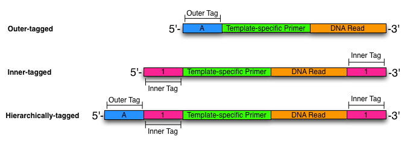

.. _hierarchical-tagging:

********************
Hierarchical tagging
********************

One of the primary features of demuxipy_ is the ability to demuxltiplex reads
that are "hierarchically tagged".  By hierarchical tagging, we generally
mean that you attach two sets of tags (which we call "Outer" and "Inner")
to each read to identify the group of reads from which it was derived.

Why hierarchical tagging?
=========================

The primary reason that you would be interested in hierarchical tagging
is when you

- need to tag lots of reads
- don't want to spend a fortune on different primers/adapters

In essence, combining two tags to identify reads gives you a much
larger number pool of combinations to use that sticking with just a
single tag.  For instance, if you use the Roche Amplicon primers and
incorporate sequence tags to those, you can sequence a pool of
approximately 150 individual samples or amplicons or environmental
amplicons.  This means that you need to purchase 150 unique adapters or
primers for use with the system.  This also precludes working with much
more than a 96-well plate of amplicons/samples at a given time.

    `Fig 1. Read-tagging and demultiplexing schemes indicating the use of an Outer tag, 
    Inner tags, and Hierarchical tags to identify multiplexed DNA reads.`

Hierarchical tagging allows us to move beyond this bottleneck by
combining tags to identify reads.
